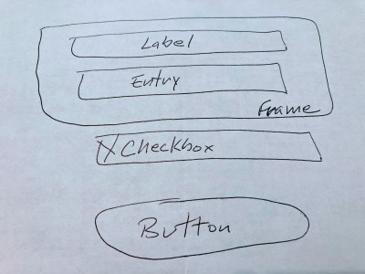
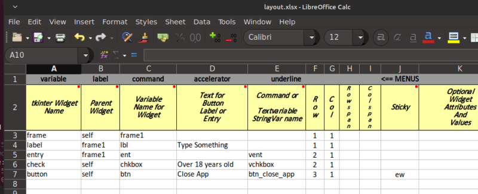
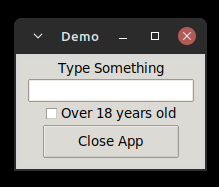
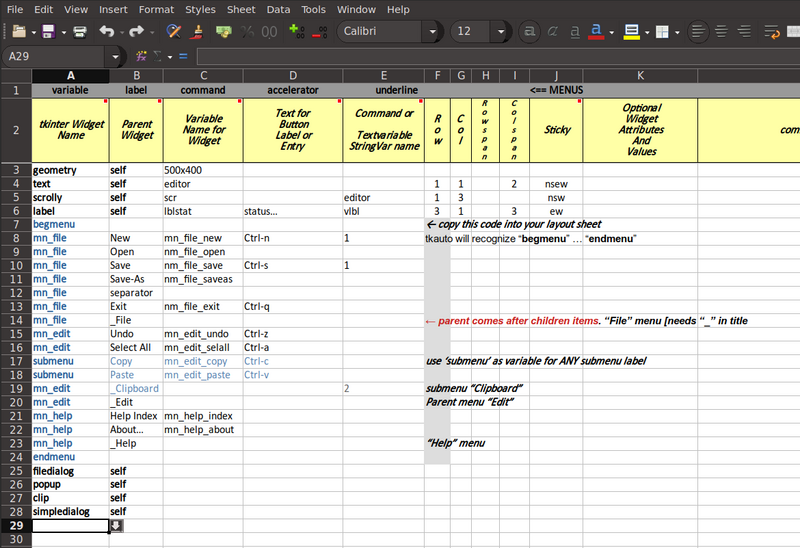
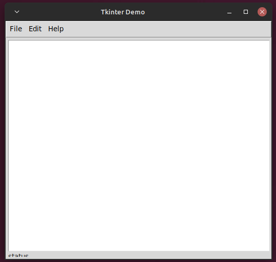
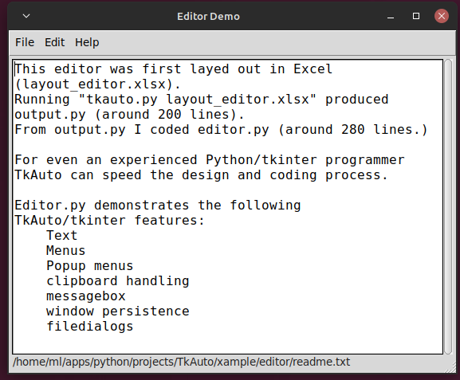

# tkauto

## Now generates code for ttkthemed and ttkbootstrap
## Can use ether .xlsx, .xlsm or .ods input spreadsheets


Laying out tkinter widgets using  
a grid and spreadsheet




tkauto inputs an xlsx (excel) file and outputs a starter script 
for a Python GUI desktop application. 

The Python script will use 
tkinter, ttk, and _ttkthemed_ or _ttkbootstrap_ for the GUI API.

Comes with Excel VBA and LibreOffice Basic macros which you can paste into
your workbooks to assist in setting up the spreadsheet rows, if you desire.

---

## Text Editor App
>Here is a little more complicated example. Please note that the
menu code (blue) was copied from an adjacent sheet as a common
starting point for menus.




Spreadsheet template:
- __layout\_tpl.xlsx__

## Generate ttk tkinter starter script

```python
usage: tkauto.py [-h] [-x] [-t] [-b] filename

tkauto build Python tkinter GUI

positional arguments:
  filename    Excel or "nofile" for -t option

options:
  -h, --help  show this help message and exit
  -x          Execute with python3 after compile
  -t          Output just the template - layout="nofile"
  -b          Use ttkbootstrap template: tkbauto_tpl.py

```
Example:

```python
    python3 tkauto.py my_layout.xlsx -o apptemp.py
```
---
## Output from tkauto.py

```python
'''
code file:
date:
commants:
    tkauto generated

'''
from tkinter import *
from tkinter.ttk import *  # defaults all widgets as ttk
import os, sys
from tkinter.font import Font
# import sys
# import webbrowser
# import pyperclip
# from tkinter import filedialog
# from tkinter import messagebox
# from tkinter import simpledialog
# from functools import partial # action_w_arg = partial(self.proc_btns, n)
from ttkthemes import ThemedTk  # ttkthemes is applied to all widgets

class Application(Frame):
    ''' main class docstring '''
    def __init__(self, parent):
        Frame.__init__(self, parent)
        self.pack(fill=BOTH, expand=True, padx=4, pady=4)
        self.create_widgets()

    def create_widgets(self):
        ''' creates GUI for app '''
        # expand widget to fill the grid
        # self.columnconfigure(1, weight=1, pad=100)
        # self.rowconfigure(1, weight=1, pad=20)

        # myfont = Font(family='Lucida Console', weight = 'bold', size = 20)

        # customize widget style when using ttk...
        # style = Style()
        # style.configure("TButton", width=10) # global
        # style.configure("my.TButton", width=10) # 'style' option

        ''' ONLY OPTIONS FOR 'grid' FUNCTIONS:
                column  row
                columnspan  rowspan
                ipadx and ipady
                padx and pady
                sticky="nsew"
        -------------------------------------------------------- '''

        root.geometry("500x400")

        self.editor = Text(self)
        self.editor.grid(row=1, column=1, columnspan=2, sticky='nsew')

        
        # efont = Font(family="Helvetica", size=14)
        # self.EDITOR.configure(font=efont)
        # self.EDITOR.config(wrap="word", # wrap=NONE
        #                    undo=True, # Tk 8.4
        #                    width=50,
        #                    height=12,
        #                    insertbackground='#000',   # cursor color
        #                    tabs=(efont.measure(' ' * 4),))
        # self.EDITOR.focus()
        ## basic handler commands #
        # .get("1.0", END)
        # .delete("1.0", END)
        # .insert("1.0", "New text content ...")
        

        self.scr = Scrollbar(self, orient=VERTICAL, command=self.editor.yview)
        self.scr.grid(row=1, column=3, sticky='nsw')  # use nse
        self.editor['yscrollcommand'] = self.scr.set

        self.vlbl = StringVar()
        lblstat = Label(self, text='status…', textvariable=self.vlbl)
        lblstat.grid(row=3, column=1, columnspan=3, sticky='ew')
        self.vlbl.set('status…')

        menubar = Menu(root)
        mn_file = Menu(menubar, tearoff=0)
        mn_file.add_command(label="New", command=self.mn_file_new, accelerator="Ctrl-n", underline=1)
        mn_file.add_command(label="Open", command=self.nm_file_open)
        mn_file.add_command(label="Save", command=self.nm_file_save, accelerator="Ctrl-s", underline=1)
        mn_file.add_command(label="Save-As", command=self.nm_file_saveas)
        mn_file.add_separator()
        mn_file.add_command(label="Exit", command=self.nm_file_exit, accelerator="Ctrl-q")
        menubar.add_cascade(label="File", menu=mn_file)
        mn_edit = Menu(menubar, tearoff=0)
        mn_edit.add_command(label="Undo", command=self.mn_edit_undo, accelerator="Ctrl-z")
        mn_edit.add_command(label="Select All", command=self.mn_edit_selall, accelerator="Ctrl-a")
        submenu = Menu(mn_edit, tearoff=False)
        submenu.add_command(label="Copy", command=self.mn_edit_copy, accelerator="Ctrl-c")
        submenu.add_command(label="Paste", command=self.mn_edit_paste, accelerator="Ctrl-v")
        mn_edit.add_cascade(label="Clipboard", menu=submenu, underline=2)
        menubar.add_cascade(label="Edit", menu=mn_edit)
        mn_help = Menu(menubar, tearoff=0)
        mn_help.add_command(label="Help Index", command=self.mn_help_index)
        mn_help.add_command(label="About…", command=self.mn_help_about)
        menubar.add_cascade(label="Help", menu=mn_help)
        root.config(menu=menubar) # display the menu


        
        # from tkinter import filedialog
        # filename =  filedialog.askopenfilename(initialdir="/",
        #             title = "Open file",
        #             filetypes = (("jpeg files", "*.jpg"),("all files", "*.*")))
        # filename = filedialog.asksaveasfilename(initialdir="/",
        #             title = "Save file",
        #             filetypes = (("jpeg files", "*.jpg"), ("all files", "*.*")))

        
        # self.popup_menu = Menu(self, tearoff=0)
        # self.popup_menu.add_command(label="Copy",
        #                             command=lambda:self.function(1))
        # self.popup_menu.add_command(label="Paste",
        #                             command=lambda:self.function(2))
        # self.popup_menu.add_separator()
        # self.popup_menu.add_command(label="say bye", command=exit)
        # self.txt.bind("<Button-3>", self.do_popup)

    # def do_popup(self,event):
    #     try:
    #         self.popup_menu.tk_popup(event.x_root,
    #                                  event.y_root)
    #     finally:
    #         self.popup_menu.grab_release()
        

        
    # def clipbrd(self,n):
    #     if n == 1:  # Copy
    #         pyperclip.copy(self.txt.selection_get())
    #     else:
    #         # n == 2:  # Paste
    #         inx = self.txt.index(INSERT)
    #         self.txt.insert(inx, pyperclip.paste())
        

        
        # # from tkinter import simpledialog
        # simpledialog.askfloat(title, prompt)
        # simpledialog.askinteger(title, prompt)
        # simpledialog.askstring(title, prompt)
        # if answer is not None:
        

    def mn_file_new(self):
        ''' docstring '''

    def nm_file_open(self):
        ''' docstring '''

    def nm_file_save(self):
        ''' docstring '''

    def nm_file_saveas(self):
        ''' docstring '''

    def nm_file_exit(self):
        ''' docstring '''

    def mn_edit_undo(self):
        ''' docstring '''

    def mn_edit_selall(self):
        ''' docstring '''

    def mn_edit_copy(self):
        ''' docstring '''

    def mn_edit_paste(self):
        ''' docstring '''

    def mn_help_index(self):
        ''' docstring '''

    def mn_help_about(self):
        ''' docstring '''


    # def eventHandler(self):
    #     pass

    # def eventHandler(self):
    #     pass

#

# UNCOMMENT THE FOLLOWING TO SAVE GEOMETRY INFO
# def save_location(e=None):
#     ''' executes at WM_DELETE_WINDOW event - see below '''
#     with open("winfo", "w") as fout:
#         fout.write(root.geometry())
#     root.destroy()

# ttkthemes
# 'alt', 'scidsand', 'classic', 'scidblue',
# 'scidmint', 'scidgreen', 'default', 'scidpink',
# 'arc', 'scidgrey', 'scidpurple', 'clam', 'smog'
# 'kroc', 'black', 'clearlooks'
# 'radiance', 'blue' : https://wiki.tcl-lang.org/page/List+of+ttk+Themes
root = ThemedTk(theme="scidmint")

# change working directory to path for this file
p = os.path.realpath(__file__)
os.chdir(os.path.dirname(p))

# UNCOMMENT THE FOLLOWING TO SAVE GEOMETRY INFO
# if os.path.isfile("winfo"):
#     with open("winfo") as f:
#         lcoor = f.read()
#     root.geometry(lcoor.strip())
# else:
#     root.geometry("400x300") # WxH+left+top


root.title("Tkinter Demo")
# root.protocol("WM_DELETE_WINDOW", save_location)  # UNCOMMENT TO SAVE GEOMETRY INFO
# Sizegrip(root).place(rely=1.0, relx=1.0, x=0, y=0, anchor=SE)
# root.resizable(0, 0) # no resize & removes maximize button
# root.minsize(w, h)  # width, height
# root.maxsize(w, h)
# root.overrideredirect(True) # removed window decorations
# root.iconphoto(False, PhotoImage(file='icon.png'))
# root.attributes("-topmost", True)  # Keep on top of other windows
app = Application(root)
app.mainloop()

```


## Finished Editor

```python
'''
code file: editor.py
date:
commants:
    tkauto generated
'''
from tkinter import *
from tkinter.ttk import *  # defaults all widgets as ttk
import os, sys
from tkinter.font import Font
from tkinter import filedialog
from tkinter import messagebox
from tkinter import simpledialog # NOTE: will NOT be styled !!!
from tkinter.messagebox import showerror
# from functools import partial # action_w_arg = partial(self.proc_btns, n)
from ttkthemes import ThemedTk  # ttkthemes is applied to all widgets

class Application(Frame):
    ''' main class docstring '''
    def __init__(self, parent):
        Frame.__init__(self, parent)
        self.pack(fill=BOTH, expand=True, padx=4, pady=4)
        self.infile = ""
        self.fontname = ""
        self.create_widgets()

    def create_widgets(self):
        ''' creates GUI for app '''

        self.editor = Text(self)
        self.editor.grid(row=1, column=1, columnspan=2, sticky='nsew')
        # efont = Font(family="Andale Mono", size=12)
        # self.editor.configure(font=efont)
        self.editor.config(wrap=NONE    , # wrap=NONE
                           undo=True, # Tk 8.4
                           width=50,
                           height=20,
                           insertbackground='#000',   # cursor color
                           )
        self.editor.focus()
        
        self.scr = Scrollbar(self, orient=VERTICAL, command=self.editor.yview)
        self.scr.grid(row=1, column=3, sticky='nsw')  # use nse
        self.editor['yscrollcommand'] = self.scr.set

        # get font,size to be used with Text widget
        if os.path.isfile("font"):
            with open("font") as f:
                self.fontname = f.read().strip()
        else:
            self.fontname = "Monospace, 12"
        fnt = self.fontname.split(",")
        fnt = [i.strip() for i in fnt]
        efont = Font(family=fnt[0], size=fnt[1])
        self.editor.configure(font=efont, tabs=(efont.measure(' ' * 4),))


        self.vlbl = StringVar()  # kind of a status bar
        lblstat = Label(self, text='status…', textvariable=self.vlbl)
        lblstat.grid(row=3, column=1, columnspan=3, sticky='ew')
        self.vlbl.set('status…')

        menubar = Menu(root)
        mn_file = Menu(menubar, tearoff=0)
        mn_file.add_command(label="New", command=self.mn_file_new, accelerator="Ctrl-n", underline=1)
        mn_file.add_command(label="Open", command=self.mn_file_open)
        mn_file.add_command(label="Save", command=self.mn_file_save, accelerator="Ctrl-s", underline=1)
        mn_file.add_command(label="Save-As", command=self.mn_file_saveas)
        mn_file.add_separator()
        mn_file.add_command(label="Exit", command=self.mn_file_exit, accelerator="Ctrl-q")
        menubar.add_cascade(label="File", menu=mn_file)
        mn_edit = Menu(menubar, tearoff=0)
        mn_edit.add_command(label="Undo", command=self.mn_edit_undo, accelerator="Ctrl-z")
        mn_edit.add_command(label="Select All", command=self.mn_edit_selall, accelerator="Ctrl-a")
        mn_edit.add_command(label="Choose Font", command=self.mn_edit_font)
        submenu = Menu(mn_edit, tearoff=False)
        submenu.add_command(label="Copy", command=self.mn_edit_copy, accelerator="Ctrl-c")
        submenu.add_command(label="Paste", command=self.mn_edit_paste, accelerator="Ctrl-v")
        mn_edit.add_cascade(label="Clipboard", menu=submenu, underline=2)
        menubar.add_cascade(label="Edit", menu=mn_edit)
        mn_help = Menu(menubar, tearoff=0)
        mn_help.add_command(label="Help Index", command=self.mn_help_index)
        mn_help.add_command(label="About…", command=self.mn_help_about)
        menubar.add_cascade(label="Help", menu=mn_help)
        root.config(menu=menubar) # display the menu

        self.columnconfigure(1, weight=1, pad=20)
        self.rowconfigure(1, weight=1, pad=20)

        self.popup_menu = Menu(self, tearoff=0)
        self.popup_menu.add_command(label="Copy",
                                    command=lambda:self.clipbrd(1))
        self.popup_menu.add_command(label="Paste",
                                    command=lambda:self.clipbrd(2))
        self.popup_menu.add_separator()
        self.popup_menu.add_command(label="Cancel",
                                    command=lambda:self.clipbrd(3))
        self.editor.bind("<Button-3>", self.do_popup)

        self.editor.bind("<Escape>", self.mn_file_exit)
        self.editor.bind("<Control-q>", self.mn_file_exit)
        self.editor.bind("<Control-o>", self.mn_file_open)
        self.editor.bind("<Control-s>", self.mn_file_save)
        self.editor.bind("<Control-n>", self.mn_file_new)
        self.editor.bind("<Control-a>", self.mn_edit_selall)

        # open a file from command - line
        if (len(sys.argv)) > 1:
            self.infile = sys.argv[1]
            f_hand = open(self.infile, "r")
            file_text = f_hand.read()
            self.editor.insert(1.0, file_text)
            self.editor.focus()
            self.editor.mark_set(INSERT, "1.0")  # place cursor at 1st character in file
            self.editor.edit_modified(False)
            self.vlbl.set(self.infile)


    def mn_edit_font(self):
        if os.path.isfile("font"):
            with open("font") as f:
                self.fontname = f.read().strip()
        self.fontname = simpledialog.askstring("Choose Font", "Current: " + self.fontname)
        if self.fontname is not None:
            with open("font", "w") as f:
                f.write(self.fontname)
            fnt = self.fontname.split(",")
            fnt = [i.strip() for i in fnt]
            efont = Font(family=fnt[0], size=fnt[1])
            self.editor.configure(font=efont)


    def do_popup(self,event):
        try:
            self.popup_menu.tk_popup(event.x_root,
                                     event.y_root)
        finally:
            self.popup_menu.grab_release()


    def clipbrd(self, n):
        ''' handle clipboard commands from context menu '''
        if n == 1:  # Copy
            if self.editor.tag_ranges("sel"):
                root.clipboard_clear()  # clear clipboard contents
                root.clipboard_append(self.editor.selection_get())  # copy to clipboard
        elif n == 3:  # Cancel
            inx = self.editor.index(INSERT)
            self.editor.insert(inx, "")
        else:
            # n == 2:  # Paste
            inx = self.editor.index(INSERT)
            self.editor.insert(inx, root.clipboard_get())  # paste


    def mn_file_new(self, event=None):
        ''' Create a New editor file '''
        if self.editor.edit_modified():  # modified
            response = messagebox.askyesnocancel(
                "Save?", "text was modified.\nsave changes?"
            )
            if response is True:
                self.mn_file_save()
        self.editor.delete("1.0", END)  # clear the Text widget
        self.editor.mark_set(INSERT, "1.0")  # place cursor at 1st character in file
        self.editor.edit_modified(False)
        self.editor.focus()
        self.infile = "untitled"
        self.vlbl.set(self.infile)


    def mn_file_open(self, event=None):
        ''' open a file from the system and put it in the editor '''
        f_name = filedialog.askopenfilename(
            filetypes=(("Text files", "*.txt"), ("all files", "*"))
        )
        if f_name:
            with open(f_name) as r_hand:
                file_text = r_hand.read()
            self.editor.delete("1.0", END)  # clear the Text widget
            self.editor.insert("1.0", file_text)
            self.editor.mark_set(INSERT, "1.0")  # place cursor at 1st character in file
            self.editor.edit_modified(False)
            self.editor.focus()
            self.infile = f_name
            self.vlbl.set(self.infile)


    def mn_file_save(self, event=None):
        ''' Save the current editor file '''
        if self.infile == "untitled":
            self.mn_file_saveas()  # This was a new file
            return
        with open(self.infile, "wb") as f_hand:
            file_text = self.editor.get(1.0, "end-1c")
            f_hand.write(bytes(file_text, "UTF-8"))
        self.editor.edit_modified(False)


    def mn_file_saveas(self, event=None):
        ''' Save current editor file as a different filename '''
        f_name = filedialog.asksaveasfilename(
            confirmoverwrite=True, initialdir=os.path.dirname(os.path.abspath(__file__))
        )
        if f_name:
            try:
                with open(f_name, "w") as f:
                    f.write(self.editor.get("1.0", END))
                self.infile = f_name
                self.vlbl.set(self.infile)
                self.editor.edit_modified(False)
            except:
                showerror("Save File", "Failed to save file\n'%s'" % f_name)
            return


    def mn_file_exit(self, event=None):
        ''' Exit the editor App '''
        if self.editor.edit_modified():  # modified
            response = messagebox.askyesnocancel(
                "Save?", "text was modified.\nsave changes?"
            )
            if response is True:
                self.mn_file_save()
        save_location()
        sys.exit()


    def mn_edit_undo(self):
        ''' docstring '''
        self.editor.edit_undo()


    def mn_edit_selall(self, event=None):
        ''' docstring '''
        self.editor.tag_add("sel", "1.0", "end")
        return "break"


    def mn_edit_copy(self, event=None):
        ''' copy selected from editor '''
        self.clipbrd(1)

    def mn_edit_paste(self, event=None):
        ''' paste clipboard to editor '''
        self.clipbrd(2)


    def mn_help_index(self):
        ''' docstring '''
        pass

    def mn_help_about(self):
        ''' docstring '''
        messagebox.showinfo("editor About", "Created by me for you.")


def save_location(e=None):
    ''' executes at WM_DELETE_WINDOW event - see below '''
    with open("winfo", "w") as fout:
        fout.write(root.geometry())
    root.destroy()

root = ThemedTk(theme="scidgreen")

# change working directory to path for this file
p = os.path.realpath(__file__)
os.chdir(os.path.dirname(p))

if os.path.isfile("winfo"):
    with open("winfo") as f:
        lcoor = f.read()
    root.geometry(lcoor.strip())
else:
    root.geometry("400x300") # WxH+left+top


root.title("Editor Demo")
root.protocol("WM_DELETE_WINDOW", save_location)
Sizegrip(root).place(rely=1.0, relx=1.0, x=0, y=0, anchor=SE)
app = Application(root)
app.mainloop()

```



END

