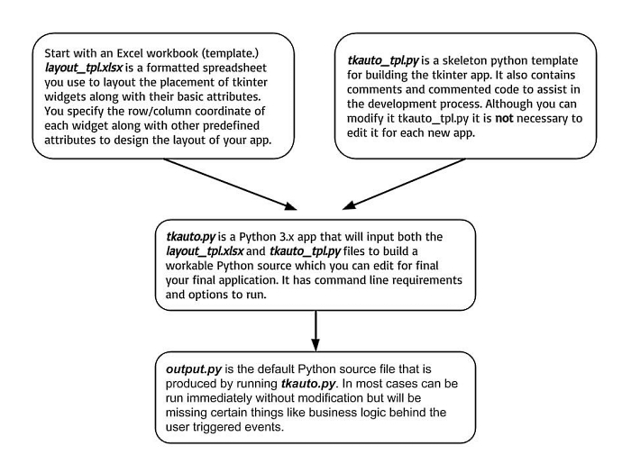
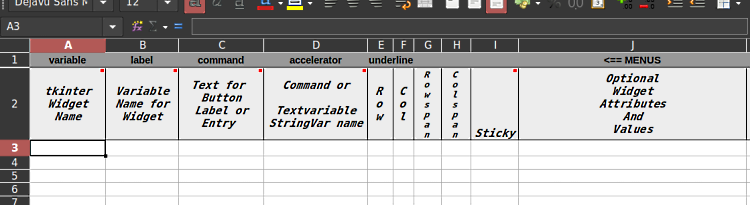
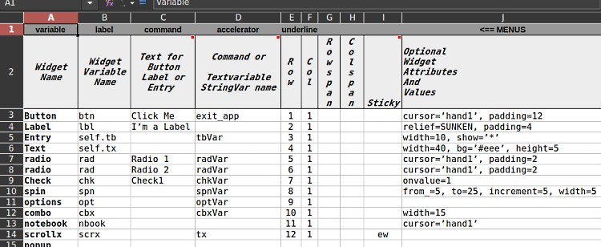
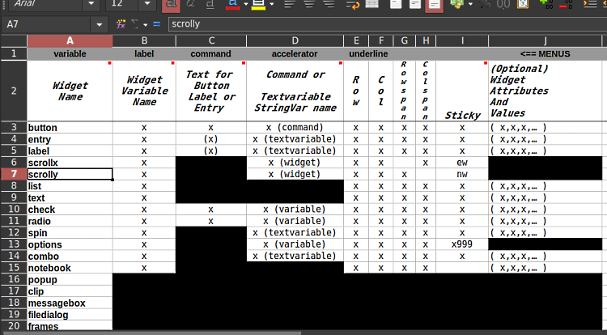
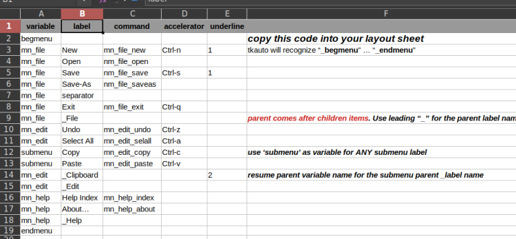

# TkAuto

"tkinter" is a useful Python module for creating GUI  
desktop applications or small utilities.

TkAuto is a Python program that uses specs from a spread-sheet  
to generate Python-tkinter code - the basis for a GUI app.

TkAuto uses an Excel spreadsheet, a Python-tkinter template, and  
the tkinter grid layout to help get the app layout coded quickly.


## Overview


 

## Setup Using Spreadsheet



`layout_tpl.xlsx' is a spreadsheet used to indicate which widgets  
your application will use, where they'll be located, and some of  
their essential options. Save-As to a different name.

Some columns are commented to further define their purpose.  
Here's a little example of how the spreadsheet is coded.  



This sheet to serves as a guide for filling in the cells for each widget.  
Note that widgets where all the cells are black will only generate  
commented code as examples for you to modify and extend.



The sheet called `menus` is an example of how to layout menus  
in the `layout` sheet.



## Tkauto Process in a Nutshell
1. **Create a layout with Excel and save to `layout.xlsx`**  
2. **Run `python tkauto.py layout.xlsx` - by default this will create `output.py`**  
3. **Make any corrections and add business logic to `output.py`**

Tkauto reads in a template file called `tkauto_tpl.py` along with your `layout.xlsx` file.  
`tkauto.py` produces an output script called `output.py`.  
When `output.py` is satisfactory you rename it and start editing the code  
to finish the application.  

Usually you will not run `tkauto.py` more than once or twice. If you need to add  
some widgets later, you will have to code them.  


*RUNNING `tkauto.py` A SECOND TIME OVER-WRITES THE `output.py` FILE*  

```
usage: tkauto.py [-h] [-o OUTFILE] filename

tkauto build Python tkinter GUI

positional arguments:
  filename    Excel (xlsx) file to use as input

optional arguments:
  -h, --help  show this help message and exit
  -o OUTFILE  output Python file

```

## The tkinter grid process

Suggestions:  
- Design your app on paper (perhaps grid-paper) old school.
- From the paper design you can easily fill in the spreadsheet.
- Perhaps iterate the previous step a few times to notice how  
  everything lays out.  
- Rename the `output.py` file and finish the coding.  

Unless one has been coding in tkinter for many years, and tkinter syntax has become  
second nature, this tkauto process does serve its goal of speeding up Python-Tkinter  
development.  

Currently these widgits and functions are supported:  
```
  button
  entry
  label
  scrollx
  scrolly
  list
  text
  check
  radio  
  spin
  options
  combo
  notebook
  geometry
  progress  
  beginmenu endmenu
  messagebox
  filedialog
  popup
  clip
  frame
```
---
