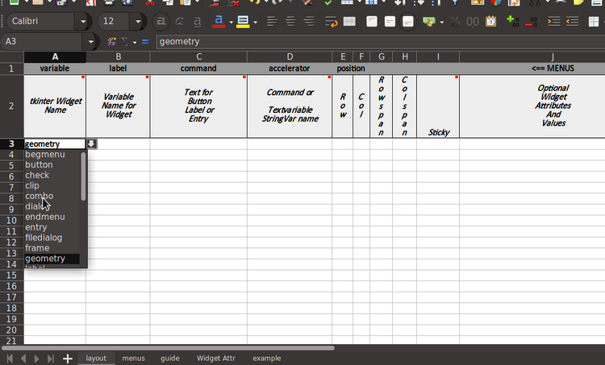
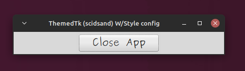

# ttkauto
Generate a themed Python GUI using a spreadsheet  
tkauto.py is a python 3.# script.  

tkauto inputs an xlsx (excel) file and builds a starter script 
for a Python GUI desktop application. The Python script will use 
tkinter, ttk, and ttkthemed for the GUI API.
<br>

## App Code Specs in Excel Spreadsheet


_layout\_tpl.xlsx_ is a spreadsheet used to indicate which widgets  
your application will use, where they'll be located, and some of  
their essential options. But first, __Save it to a different name__.

Some columns are commented to further define their purpose.



Here's a little more already filled in.

There is a minimum of options provided in the spreadsheet.  
It usually will run with out editing to check the general placements.  

In the _layout\_tpl.xlsx_ workbook there is a sheet called guide.  


## Generate the script

```
usage: tkauto.py [-h] [-o OUTFILE] [-x] filename

positional arguments:
  filename    Excel (xlsx) file to use as input

optional arguments:
  -h, --help  show this help message and exit
  -o OUTFILE  output Python file
  -x          Execute with python3 after compile

```

## Example Run

```
python3 tkauto.py mylayout.xlsx -o myapp.py -x
or
python3 tkauto.py layout.xlsx

```
When the "-o" option is not used tkauto.py produces an output file
called "output.py".

The output file is what you __rename__ and start editing to finish the application.  

Usually you will not run `tkauto.py` more than once or twice. If you forgot some widgets
or options usually you can just edit them in.

**_BE CAREFUL_**  
RUNNING tkauto.py creates a completely new output file each time.  

---

The output for this example is shown below with some minor editing to the event handlers.



```
from tkinter import *
from tkinter.ttk import *  # defaults all widgets as ttk
from ttkthemes import ThemedTk  # module applied to all widgets
                                # pip install ttkthemes

class Application(Frame):
    ''' use oop format for GUI program '''
    def __init__(self, master=None):
        super().__init__(master)
        self.pack()
        self.create_widgets()

    def create_widgets(self):
        ''' define widgets and show '''
        style = Style()
        style.configure('TButton', width=14, font='Purisa 15')

        btn1 = Button(self, text="Close App", command=exit)
        btn1.grid(row=0,column=0, padx=5, pady=5)

        btn2 = Button(self, text="Ok", command=exit)
        btn2.grid(row=1,column=0, padx=5, pady=5)

# 'alt', 'scidsand', 'classic', 'scidblue',
# 'scidmint', 'scidgreen', 'default', 'scidpink',
# 'arc', 'scidgrey', 'scidpurple', 'clam'
root = ThemedTk(theme="scidsand")
root.title("ThemedTk (scidsand) W/Style config")
app = Application(master=root)
app.mainloop()
```

---
